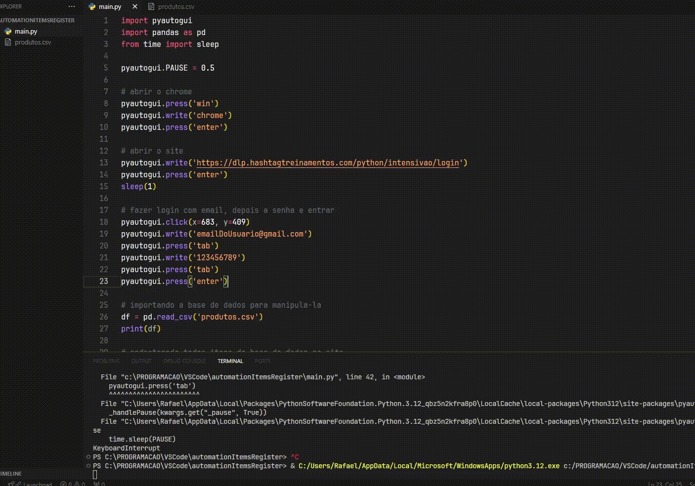

# Excel-Automation-Web-Stock <h6>Portugues</h6>

<h3 align="center">Uma automação de planilha de excel com cadastro em site</h3>

<h1 align="center">
</img>
</h1>

<h2>Como funciona:</h2>
<h3 align="center">Quando executar o script ele automáticamente abrirá o site de estoque da empresa (de sua escolha) e
fará o cadastro de todos os itens que estão dentro da planilha do Excel, até que esses acabem todos
cadastrados.</h3>

  <footer>
     
    <a href="https://www.instagram.com/vinyyboy_seewald/" target="_blank"></img></a>
    <h5>| Feito com ❤️ por: Rafael Seewald👋|</h5>
  </footer>

